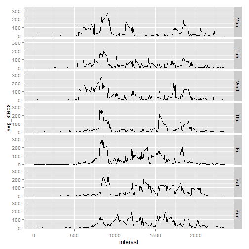

# Reproducible Research: Peer Assessment 1

## Introduction

It is now possible to collect a large amount of data about personal movement using activity monitoring devices such as a Fitbit, Nike Fuelband, or Jawbone Up. These type of devices are part of the "quantified self" movement - a group of enthusiasts who take measurements about themselves regularly to improve their health, to find patterns in their behavior, or because they are tech geeks. But these data remain under-utilized both because the raw data are hard to obtain and there is a lack of statistical methods and software for processing and interpreting the data.

This assignment makes use of data from a personal activity monitoring device. This device collects data at 5 minute intervals through out the day. The data consists of two months of data from an anonymous individual collected during the months of October and November, 2012 and include the number of steps taken in 5 minute intervals each day.

## Details about the DATA that is being used for this project

The data for this assignment can be downloaded from my GITHUB repository:

Dataset: Activity monitoring data [52K]

The variables included in this dataset are:

* steps: Number of steps taking in a 5-minute interval (missing values are coded as NA)

* date: The date on which the measurement was taken in YYYY-MM-DD format

* interval: Identifier for the 5-minute interval in which measurement was taken

The dataset is stored in a comma-separated-value (CSV) file and there are a total of 17,568 observations in this dataset.

## Loading and preprocessing the data

Initially the connection is done with the help of UNZ to the activity.zip file that was provided as part of this project.


```r
actcon <- unz("activity.zip","activity.csv")
```

Read the file in table format and create a ACTIVITY data frame. 


```r
  activity <- read.table(file = actcon,header = TRUE,sep = ",")
activity$datetime <- as.POSIXct(
  with(
    activity,
    paste(
      date,
      paste(interval %/% 100, interval %% 100, sep=":"))
    ),
  format="%Y-%m-%d %H:%M",tz="")
```


## What is mean total number of steps taken per day?

Load the required libraries including ggplots, scales, grid and gridextra


```r
library(ggplot2)
library(scales)
library(grid)
library(gridExtra)
```

Aggregate the number of steps and store the value in stepsbyDay variable.


```r
stepsbyDay <- setNames(
  aggregate(
    steps~as.Date(date),
    activity,
    sum,
    na.rm = TRUE),
  c("date","steps")
  )
```

Generate the histogram 


```r
# Generate the Histogram.
hist1 <- ggplot(stepsbyDay,aes(x=date,y=steps)) +
  geom_bar(stat="identity") +
  ggtitle("Total number of steps by day -  Actual Data")
print(hist1)
```

 

Summarize the StepsByDate with the following code:


```r
  summary(stepsbyDay$steps)
```

```
##    Min. 1st Qu.  Median    Mean 3rd Qu.    Max. 
##      41    8841   10760   10770   13290   21190
```

Pring the mean steps by date and median steps by date:


```r
  mmsteps <- c(mean = mean(stepsbyDay$steps),median = median(stepsbyDay$steps))
  print(mmsteps)
```

```
##     mean   median 
## 10766.19 10765.00
```

## What is the average daily activity pattern?

Here is the average daily activity pattern with the graph shown below:


```r
  avgPat <- aggregate(steps~interval,activity,mean,na.rm = TRUE)
  avgPat$time <- as.POSIXct(with(avgPat,paste(interval %/% 100, interval %% 100, sep=":")),format="%H:%M")
  plot <- ggplot(avgPat,aes(x=time,y=steps)) +
  geom_line() +
  scale_x_datetime(breaks = date_breaks("2 hour"),labels = date_format("%H:%M"))
  print(plot)
```

 


```r
  with(avgPat,avgPat[steps == max(steps),])
```

```
##     interval    steps                time
## 104      835 206.1698 2015-03-15 08:35:00
```


## Inputing missing values


```r
  mis <- aggregate(cnt~date,cbind(activity[is.na(activity$steps),],cnt=c(1)),sum,na.rm = FALSE)
  mis$dow <- weekdays(as.Date(mis$date),abbreviate=TRUE)
  print(mis[,c(1,3,2)])
```

```
##         date dow cnt
## 1 2012-10-01 Mon 288
## 2 2012-10-08 Mon 288
## 3 2012-11-01 Thu 288
## 4 2012-11-04 Sun 288
## 5 2012-11-09 Fri 288
## 6 2012-11-10 Sat 288
## 7 2012-11-14 Wed 288
## 8 2012-11-30 Fri 288
```


```r
  unique(mis$dow)
```

```
## [1] "Mon" "Thu" "Sun" "Fri" "Sat" "Wed"
```


```r
  ref_ds <- aggregate(steps~interval+weekdays(datetime,abbreviate=TRUE),activity,FUN=mean,na.rm=TRUE)
  colnames(ref_ds) <- c("interval","dow","avg_steps")
  ref_ds$dow <- factor(ref_ds$dow,levels = c("Mon","Tue","Wed","Thu","Fri","Sat","Sun"))
  ggplot(ref_ds,aes(x=interval,y=avg_steps)) + geom_line() + facet_grid("dow ~ .")
```

 


```r
  activity$dow <- weekdays(activity$datetime,abbreviate=TRUE)
  af <- merge(activity,ref_ds,by=c("dow","interval"),all.x = TRUE)
  af <- af[with(af,order(date,interval)),]
  af$fixed_steps <- ifelse(is.na(af$steps),af$avg_steps,af$steps)
```


```r
  stepsinforDaytwo <- setNames(
      aggregate(
          fixed_steps~as.Date(date),
          af,
          sum,
          na.rm = TRUE),
      c("date","steps")
    )
  hist2 <- ggplot(stepsinforDaytwo,aes(x=date,y=steps)) + 
  geom_bar(stat="identity") + 
  ggtitle("Total number of steps per day - Fixed Data")
  grid.arrange(hist1, hist2, nrow=2)
```

 


```r
  steps2 <- c(mean = mean(stepsinforDaytwo$steps),median = median(stepsinforDaytwo$steps))
  comparison <- rbind(source = mmsteps, fixed = steps2, delta = steps2-mmsteps)
  print(comparison)
```

```
##               mean median
## source 10766.18868  10765
## fixed  10821.20960  11015
## delta     55.02092    250
```


## Are there differences in activity patterns between weekdays and weekends?

Yes there is some peak activity on Weekday and more consistent activity happening on the weekend.


```r
weekday_diff <- aggregate(
  steps~dow+interval, 
  with(
    activity,
    data.frame(
      dow = factor(
        ifelse(
          weekdays(as.Date(date)) %in% c("Sunday","Saturday"),
          "weekend",  
          "weekday"   
        )
      ),
      interval,
      steps
    )
  ),
  FUN = mean,
  rm.na = TRUE
)
```


```r
  ggplot(weekday_diff,aes(x=interval,y=steps)) + geom_line() + facet_grid("dow ~ .")
```

 

